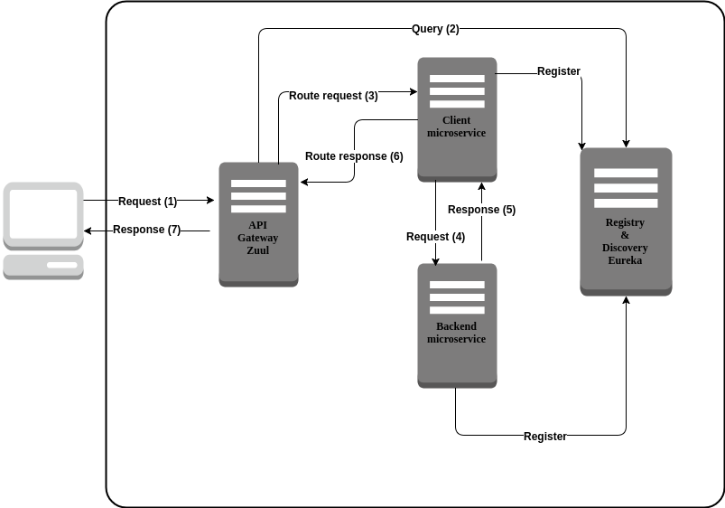

# Client - Server

Application has been created for technical test purpose during interview process.

Solutions consists of three microservices
  - Client
  - Backend
  - Discovery (Spring Eureka)
  - Gateway (Spring Zuul)

### Requirements

The requirements for running this application on your machine are found below
  - Java 8
  - Maven 3
  - Docker
  - Docker Compose

### Architecture



### Installation

First of all, run below command in the terminal at the root of the project.

```sh
$ mvn clean install
```

Maven will compile source code, run unit and integration tests and produce artifact for each service. Additionally maven will build Docker images into your local Docker registry.

Now we will use Docker Compose to spin up cluster with our four microservices. Pre-configured yaml file for Docker Compose is shipped with the project.

```sh
docker-compose -f docker-compose.yml up
```

Each image of container will be build, launched and networked for service discovery. The whole process might take few minutes to complete.

Once spin up our microservices is done, you can go to **http://localhost:8777** which leads to the Eureka  where you can check services registered with the discovery service. You should see two microservices called client and backend registered.

### Endpoints

Client microservice has one endpoint called **/process**. It consumes JSON using HTTP POST. Request has three fields as a **firstOperand**, **secondOperand** and **operation**. Please see example below.

```json
{
  "firstOperand" : "5",
  "secondOperand" : "5",
  "operation" : "ADD"
}
```
Available operations types : **ADD**, **SUBTRACT**, **MULTIPLY**, **DIVIDE**

Backend microservice has also one endpoint called **/compute** which is used by client microservice. It consumes JSON using HTTP POST. Request has also three fields as a **firstOperand**, **secondOperand** and **operation**, the same as request for client.

Ideally, all those above APIs **should** be accessed through API Gateway (Zuul), so we might perform client-side load balancing for requests across many instances of microservices. Main entry points for gateway are :

| API  | Service |
| :-------------: | :-------------: |
| /api/client/**  | client  |
| /api/backend/**  | backend  |

API Gateway should be accessible under  **http://localhost:8888**

### Hystrix

Client microservice has built-in mechanism called Circuit Breaker.

This pattern gives applications opportunity that rely on connectivity to external service to protect themselves from failure when any external service goes down. It prevents the failure from cascading and giving the failing service time to recover. Instead of seeing ugly exception from client microservice while backend microservice is down, you should see message like *Backend service not available. Please try later.* [More info](https://martinfowler.com/bliki/CircuitBreaker.html)

### Postman

Postman collection has been attached to project to bring support for developers to test client microservice via API Gateway.

### Technology

##### Stack

- Java - 1.8.0_121
- Spring Boot - 1.5.7.RELEASE

##### Libraries

- Hystrix - 1.3.4.RELEASE
- Feign - 1.3.4.RELEASE
- Eureka - 1.3.4.RELEASE
- Zuul - 1.3.4.RELEASE
- HttpComponents - 4.5.3
- TypeOf - 0.0.1

### License
Code released under the  Apache License 2.0. Docs released under Creative Commons.

[](https://ghit.me/repo/GarciaPL/ClientBackend)
